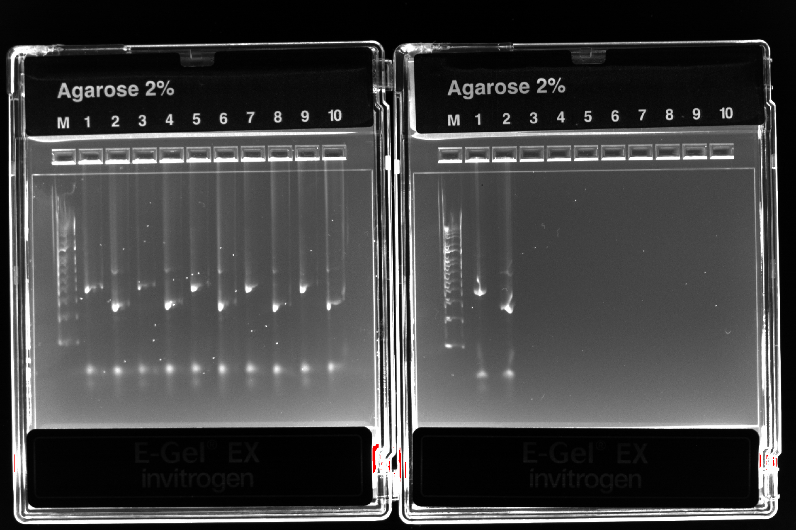
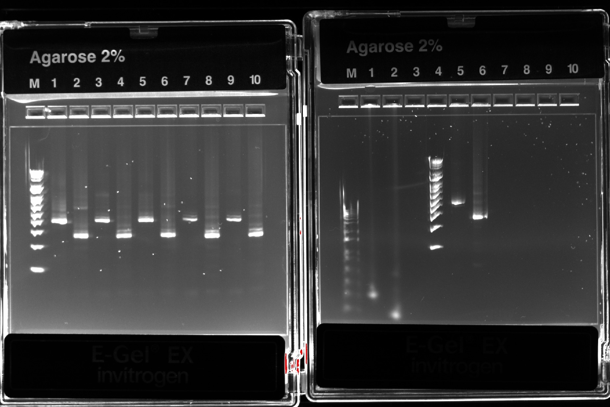
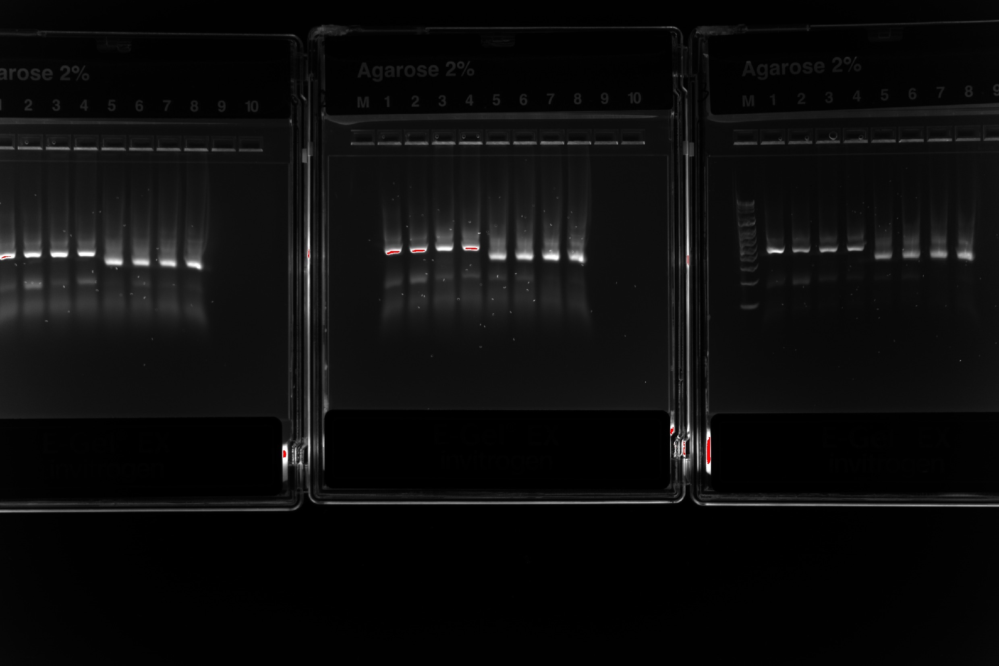

## Polyacrylamide bead formation

For each sample:

a) Combine the following reagents in a 2 ml round-bottom safe-lock microtube and vortex gently: 
- 120 µl sample material * 
- 80 µl 30% BIS/acrylamide (storage temp: 4 °C) 
- 25 µl 10% APS (storage temp: -20 °C)

*Samples:

1: Rhodomonas + Chilomonas + Ochromonas (Biological standard):
- The final cell density for approximately 40 000 cells/ml rhodomonas, 4 000 cells/ml chilomonas, and 400 cells/ml ochromonas
- 25 µl +  4 µl + 1 µl (respectively) + 90 µl PCR water

2: Wastewater (ww) + Rhodomonas + Chilomonas + Ochromonas:
- 90 µl + 25 µl +  4 µl + 1 µl (respectively)

3: Wastewater: 
- 120 µl

b) Shake & mix STT emulsion oil* thoroughly before use!  
- *) 2,25 ml Span 80 + 200 µl Tween 80 + 25 µl Triton X-100, Mineral oil to 50 ml.
- Add 600 µl STT emulsion oil. (storage temp: RT) 
- Vortex at max speed (3 000 rpm) for 30 s.

c) Add 25 µl TEMED.  (storage temp: RT) 
- Vortex at max speed (3 000 rpm) for 30 s.

d) Allow tube to sit on the benchtop for polymerization to occur for 1h 30 min

e) Removal of oil:
- Equal volumes of water and diethyl ether (at least 50 % water!) mixed, shaken and opened occasionally to prevent pressure from building up.
- Add 800 µl of diethyl ether to the tube, then immediately close, invert and flick the tube to mix the emulsion with the ether. A visible precipitate ought to form. Draw off the ether/oil mixture around the precipitate and discard. The diethyl ether wash performed twice 
- Add 1 ml of autoclaved H2O to the top of the tube and mix by flicking and inverting. Centrifuge for 30 s at 12 000rcf. Three layers should form: a bottom layer of beads, a middle cloudy layer of oil/water, and a top milky layer of oil. Draw off the top oil layer as much as possible and discard.
- Repeat the H2O wash steps until there is no remaining oil at the top of the tube and the liquid phase is transparent (at least 4 times).

f) The beads were suspended in 500 µl of PCR water and stored in 4°C

## Fusion PCR
Samples:

1. Rhodo/Chilo/Ochro
2. Rhodo/Chilo/Ochro + WW
3. WW

- E = fluor-oil 1:10 mocks (3e4 to 3e6 molecules)
- F = fluor-oil 1:100 mocks (3e3 to 3e5 molecules)
- G = mineral oil 1:10 mocks
- H = mineral oil 1:100 mocks

###### Fusion PCR for mineral oil samples (G and H)

Prepare the PCR master mix (two separately for 1:10 or 1:100 mock mix):
| Reagent | 1X | 3X |
| :---: | :---: | :---: |
| 5xGC buffer | 20 µl | 60 µl |
| 50 mM MgCl2 | 2 µl | 6 µl |
| dNTP mix (10 mM each) | 2.5 µl | 7.5 µl |
| 10 µM R2 and F1 primers (3, each) | 10 µl | 30 µl |
| 10 µM R1-F2’ and F2-R1' primers (4, each)  | 1 µl | 3 µl |
| Barcode 1e4 | 1 µl | 3 µl |
| 10x OR 1x Mock mix | 1 µl | 3 µl |
| Phusion DNA polymerase (2 U/µl) | 8 µl | 24 µl |

a)  Add 3-5 glass beads (apart from the sample 1H, which had 10) to the tubes and 68.5µl of master mix. Add 31.5 µl of sample beads.

b)  Add 900µl of 4% Abil Em90 in mineral oil to each tube -> vortex for 1 min and distribute 100-120µl of each sample to 7-8 wells of 8-well strips.

Running PCR:
| Step | Temperature (°C) | Time | Number of cycles |
| :---: | :---: | :---: | :---: |
| Beginning temperature | 80 | 10 s | 1 |
| Initial denaturation | 94 | 30 s | 1 |
| Denaturation | 94 | 5 s | 32 |
| Annealing | 55 | 30 s | 
| Extension | 72 | 30 s | 
| Final extension | 72 | 5 min | 1
| Storing temperature | 4 | Inf | 1

d) Break abil emulsion:
- Add 1 ml of diethyl ether -> vortex -> centrifuge 1 min 13000rcf -> draw off the top phase 
- 50 µl of H2O -> repeat previous step
- Add 500 µl of ethyl acetate -> vortex -> spin -> draw off the top phase
- 2 x diethyl ether washes: Add 1ml -> tapping -> draw off the top phase and leave the tube cap open
- Leave tubes open for extra 5 mins to evaporate the ether
- Transfer the bottom phase (100 µl) to a new tube and store in the freezer (in this case overnight)

g) Cleanup with Monarch® PCR & DNA Cleanup Kit (5 μg)

###### Fusion PCR for fluorinated oil samples

Prepare the PCR master mix (two separately for 1:10 or 1:100 mock mix):
| Reagent | 1X | 6X |
| :---: | :---: | :---: |
| 5xGC buffer | 20 µl | 120 µl |
| 50 mM MgCl2 | 2 µl | 12 µl |
| dNTP mix (10 mM each) | 2.5 µl | 15 µl |
| 10 µM R2 and F1 primers (3, each) | 10 µl | 60 µl |
| 10 µM R1-F2’ and F2-R1' primers (4, each)  | 1 µl | 6 µl |
| Phusion DNA polymerase (2 U/µl) | 8 µl | 48 µl |

1 µl of barcode-DNA + 1 µl of "Mock mix" was added.
E samples: 10e4 bc molecules, 1:10 mock mix
F samples: 10e4 bc molecules, 1:100 mock mix

a)  Combine 32 µl of sample (bead suspension), 66 µl of master mix and 2 µl of barcode and synthetic control as above. Add 100 µl of fluorinated oil with surfactant. 

b)  Place in shaker for 5 min and draw the emulsion through droplet splitter.

c)  Aliquot to two PCR tubes and cover with 50 µl of mineral oil. Chip washed with HFE7500 between samples.  

Running PCR:
| Step | Temperature (°C) | Time | Number of cycles |
| :---: | :---: | :---: | :---: |
| Beginning temperature | 80 | 10 s | 1 |
| Initial denaturation | 94 | 30 s | 1 |
| Denaturation | 94 | 5 s | 32 |
| Annealing | 55 | 30 s | 
| Extension | 72 | 30 s | 
| Final extension | 72 | 5 min | 1
| Storing temperature | 4 | Inf | 1

d) Pool the emulsion aliquots for each sample into a new safe-lock tube.

e) Separate the phases (top: mineral oil, middle: emulsion, bottom: surplus fluorinated oil) by spinning and discard the mineral oil. Some fluorinated oil may also be removed, if applicable.

f) Add 50 µl of PFO, mix and spin. The upper aqueous phase is collected / bottom phase discarded

g) Cleanup with Monarch® PCR & DNA Cleanup Kit (5 μg)

## 16S and 18S blocking

Prepare the PCR master mix (performed separately for the mineral oil and fluorinated oil samples):
| Reagent | 1X | 14X (m) | 12X (f) |
| :---: | :---: | :---: | :---: |
| PCR H2O | 7.25 µl | 101.5 µl | 141 µl |
| 5xGC buffer | 5 µl | 70 µl | 60 µl |
| dNTP mix (10 mM each) | 0.5 µl | 7 µl | 6 µl |
| 32 µM BlockF-16S and BlockR-16S primers | 2.5 µl | 35 µl | 30 µl |
| 32 µM BlockF-18S and BlockR-18S primers | 2.5 µl | 35 µl | 30 µl |
| Phusion DNA polymerase (2 U/µl) | 0.25 µl | 3.5 µl | 3 µl |

45µl of master mix to each sample well of 8-well strip and 5µl of template (1 well per sample).

Running PCR:
| Step | Temperature (°C) | Time | Number of cycles |
| :---: | :---: | :---: | :---: |
| Beginning temperature | 98 | 30 s | 1 |
| Denaturation | 98 | 10 s | 30 |
| Annealing | 55 | 30 s | 
| Extension | 72 | 30 s | 
| Final extension | 72 | 5 min | 1 |
| Storing temperature | 4 | Inf | 1 |

Cleanup with Monarch® PCR & DNA Cleanup Kit (5 μg).

## Nested PCR 

Prepare 2 PCR master mixes (with either 16S and 18S nested primers), 4x reactions per sample (performed separately to min oil and fluor oil samples):
| Reagent | 1X | 25X |
| :---: | :---: | :---: |
| PCR H2O | 14.75 µl | 368.75 µl |
| 5xGC buffer | 5 µl | 125 µl |
| dNTP mix (10 mM each) | 0.5 µl | 12.5 µl |
| Primer mix * either 16S or 18S | 2.5 µl | 62.5 µl |
| Phusion DNA polymerase (2 U/µl) | 0.25 µl | 6.25 µl |

(*) Primer mixes: 
- 16S: 16S nested primers (4 primers), i5 forward, BlockF, BlockR; (3µM each) 
- 18S: 18S nested primers (4 primers), i5 forward, BlockF, BlockR; (3µM each)

Combine 23 µl mastermix + 2 µl of sample (from blocking PCR), 4 replicates each sample

Running PCR:
| Step | Temperature (°C) | Time | Number of cycles |
| :---: | :---: | :---: | :---: |
| Beginning temperature | 98 | 30 s | 1 |
| Denaturation | 98 | 10 s | 24 |
| Annealing | 55 | 30 s | 
| Extension | 72 | 30 s | 
| Final extension | 72 | 5 min | 1
| Storing temperature | 4 | Inf | 1

Replicate samples pooled and cleanup with Monarch® PCR & DNA Cleanup Kit (5 μg).

Gel electrophoresis: 
Agarose gel casket: Invitrogen E-Gel® EX with SYBR® Gold II, 2% agarose, program: E-Gel EX 1–2% (10 mins)

###### Mineral oil samples

<td valign="top"></td>

Left:

- M 1 kb marker
1. Biol std 16S high mock 
2. Biol std 18S high mock 
3. Biol std + ww 16S higher mock
4. Biol std + ww 18S higher mock
5. ww 16S higher mock
6. ww 18S higher mock
7. Biol std 16S lower mock
8. Biol std 18S lower mock
9. Biol std + ww 16S lower mock
10. Biol std + ww 18S lower mock

Right:

- M 1 kb marker
1. ww 16S lower mock
2. ww 18S lower mock

###### Fluorinated oil samples

<td valign="top"></td>

Left:

- M 1 kb marker
1. Biol std 16S high mock 
2. Biol std 18S high mock 
3. Biol std + ww 16S higher mock
4. Biol std + ww 18S higher mock
5. ww 16S higher mock
6. ww 18S higher mock
7. Biol std 16S lower mock
8. Biol std 18S lower mock
9. Biol std + ww 16S lower mock
10. Biol std + ww 18S lower mock

Right:

- M 1 kb marker
5. ww 16S lower mock
6. ww 18S lower mock

## Indexing

16S and 18S barcoding experiments were further prepared for sequencing using indexing primers.

Primers used:

| Sample | Emulsion and mock-oligos | Target | i5 primer | i7 primer | 
| :---: | :---: | :---: | :---: | :---: |
| Biol standard | Fluorinated oil, 3e4 to 3e6 | 16S | N701 (89) | S502 (97) |
| Biol standard | Fluorinated oil, 3e3 to 3e5 | 16S | N701 (89) | S503 (98) |
| Biol standard | Mineral oil, 3e4 to 3e6 | 16S | N701 (89) | S505 (99) |
| Biol standard | Mineral oil, 3e3 to 3e5 | 16S | N701 (89) | S506 (100) |
| Biol standard | Fluorinated oil, 3e4 to 3e6 | 18S | N701 (89) | S507 (101) |
| Biol standard | Fluorinated oil, 3e3 to 3e5 | 18S | N701 (89) | S508 (102) |
| Biol standard | Mineral oil, 3e4 to 3e6 | 18S | N701 (89) | S510 (103) |
| Biol standard | Mineral oil, 3e3 to 3e5 | 18S | N701 (89) | S511 (104) |
| WW + Biol standard | Fluorinated oil, 3e4 to 3e6 | 16S | N702 (90) | S502 (97) |
| WW + Biol standard | Fluorinated oil, 3e3 to 3e5 | 16S | N702 (90) | S503 (98) |
| WW + Biol standard | Mineral oil, 3e4 to 3e6 | 16S | N702 (90) | S505 (99) |
| WW + Biol standard | Mineral oil, 3e3 to 3e5 | 16S | N702 (90) | S506 (100) |
| WW + Biol standard | Fluorinated oil, 3e4 to 3e6 | 18S | N702 (90) | S507 (101) |
| WW + Biol standard | Fluorinated oil, 3e3 to 3e5 | 18S | N702 (90) | S508 (102) |
| WW + Biol standard | Mineral oil, 3e4 to 3e6 | 18S | N702 (90) | S510 (103) |
| WW + Biol standard | Mineral oil, 3e3 to 3e5 | 18S | N702 (90) | S511 (104) |
| WW | Fluorinated oil, 3e4 to 3e6 | 16S | N703 (91) | S502 (97) |
| WW | Fluorinated oil, 3e3 to 3e5 | 16S | N703 (91) | S503 (98) |
| WW | Mineral oil, 3e4 to 3e6 | 16S | N703 (91) | S505 (99) |
| WW | Mineral oil, 3e3 to 3e5 | 16S | N703 (91) | S506 (100) |
| WW | Fluorinated oil, 3e4 to 3e6 | 18S | N703 (91) | S507 (101) |
| WW | Fluorinated oil, 3e3 to 3e5 | 18S | N703 (91) | S508 (102) |
| WW | Mineral oil, 3e4 to 3e6 | 18S | N703 (91) | S510 (103) |
| WW | Mineral oil, 3e3 to 3e5 | 18S | N703 (91) | S511 (104) |

 Prepare following PCR mix :

| Reagent | 1X | 100X |
| :---: | :---: | :---: |
| H2O | 12,4 µl | 1240 µl |
| 5x HF buffer | 4 µl | 400 µl |
| dNTP mix (10 mM each) | 0,4 µl | 40 µl |
| Phusion DNA polymerase (2 U/µl) | 0,2 µl | 20 µl |
| i5 primer (10 µM) | 1 µl | - |
| i7 primer (10 µM) | 1 µl | - |

Pipette 17 µl mastermix, 1 µl of appropriate primers each, and 1 µl template (purified nested PCR product) to 4 PCR tubes per sample 

b) Run the following cycling program:

| Step | Temperature (°C) | Time | Number of cycles |
| :---: | :---: | :---: | :---: |
| Beginning temperature | 98 | 30 s | 1 |
| Denaturation | 98 | 10 s | 12 |
| Annealing | 55 | 20 s | 
| Extension | 72 | 20 s | 
| Final extension | 72 | 5 min | 1 |
| Storing temperature | 4 | Inf | 1 |

Pool replicate reactions, mix, and load 20 µl to a gel. Excise the correct-sized product and purify with Monarch® PCR & DNA Cleanup Kit (5 μg) and gel dissolving buffer.
(Agarose gel casket: Invitrogen E-Gel® EX with SYBR® Gold II, 2% agarose, program: E-Gel EX 1–2% (10 mins))

<td valign="top"></td>

Left to right:
Biological standards (16S and 18S)
Biological standards + ww (16S and 18S)
(1 kb marker)
ww (16S and 18S)

## Sample pooling and sequencing

The DNA concentration of the purified PCR products was measured by Qubit, a library was created by combining the products in equal DNA amounts (0,23 ng/µl concentration), and the DNA concentration of the resulting mix was measured again for confirmation (6,76 ng/µl, which is 31 nM).  

The library was diluted to 4nM using elution buffer (Qiagen). 

Preparing the library for sequencing:

a) Prepare a Fresh Dilution of NaOH:  
- Combine the following volumes in a microcentrifuge tube: Laboratory-grade water (16 μl) + Stock 1.0 N NaOH (4 μl)  
- Invert the tube several times to mix.  

b) Prepare HT1  
- Remove HT1 from -25°C to -15°C storage and thaw at room temperature.  
- Store at 2°C to 8°C until you are ready to dilute denatured libraries.  

c) Denature a 4 nM Library :
- Combine the following volumes in a microcentrifuge tube: 4 nM library (5 μl) + 0.2N NaOH (5 μl)  
- Vortex briefly and then centrifuge at 280 × g for 1 minute.  
- Incubate at room temperature for 5 minutes.  

d) Add 990 μl prechilled HT1 to the tube containing denatured library. The result is 1 ml of a 20 pM denatured library.  

e) Dilute Denatured 20 pM Library: 
- Dilute to 6pM using the following volumes: 20 pM library (180 μl) + Prechilled HT1 (420 μl) 
- Invert to mix and then pulse centrifuge.  

The sample was loaded into the casette and the sequencing was performed in the Turku Bioscience facilities, using Illumina's MiSeq .
